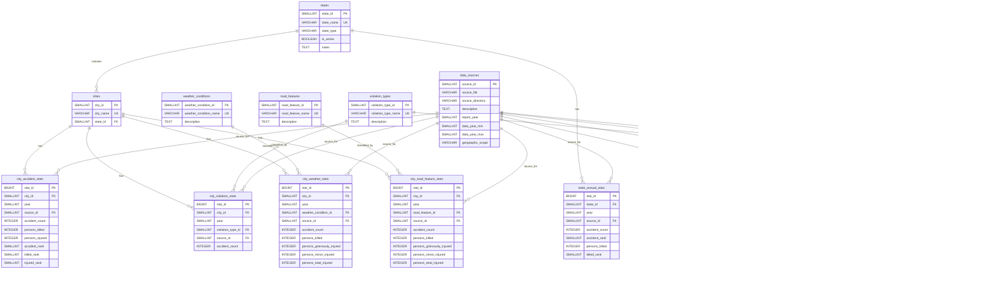

# DATABASE ERD — ROAD INSIGHT

This Entity-Relationship Diagram represents the normalized PostgreSQL schema for the Road Insight project.

```mermaid
erDiagram
    data_sources {
        SMALLINT source_id PK
        VARCHAR source_file
        VARCHAR source_directory
        TEXT description
        SMALLINT report_year
        SMALLINT data_year_min
        SMALLINT data_year_max
        VARCHAR geographic_scope
    }
    
    states {
        SMALLINT state_id PK
        VARCHAR state_name UK
        VARCHAR state_type
        BOOLEAN is_active
        TEXT notes
    }
    
    cities {
        SMALLINT city_id PK
        VARCHAR city_name UK
        SMALLINT state_id FK
    }
    
    weather_conditions {
        SMALLINT weather_condition_id PK
        VARCHAR weather_condition_name UK
        TEXT description
    }
    
    road_features {
        SMALLINT road_feature_id PK
        VARCHAR road_feature_name UK
        TEXT description
    }
    
    collision_types {
        SMALLINT collision_type_id PK
        VARCHAR collision_type_name UK
        TEXT description
    }
    
    violation_types {
        SMALLINT violation_type_id PK
        VARCHAR violation_type_name UK
        TEXT description
    }
    
    national_historical_stats {
        BIGINT stat_id PK
        SMALLINT year UK
        SMALLINT source_id FK
        INTEGER total_accidents
        INTEGER total_killed
        INTEGER total_injured
        NUMERIC population_thousands
        NUMERIC registered_vehicles_thousands
        NUMERIC road_length_km
        NUMERIC accidents_per_lakh_pop
        NUMERIC killed_per_lakh_pop
        NUMERIC injured_per_lakh_pop
    }
    
    national_annual_stats {
        BIGINT stat_id PK
        SMALLINT year UK
        SMALLINT source_id FK
        INTEGER total_accidents
        INTEGER total_fatalities
        INTEGER total_injured
        NUMERIC accidents_pct_change
        NUMERIC fatalities_pct_change
        NUMERIC injured_pct_change
    }
    
    state_annual_stats {
        BIGINT stat_id PK
        SMALLINT state_id FK
        SMALLINT year
        SMALLINT source_id FK
        INTEGER accident_count
        SMALLINT accident_rank
        INTEGER persons_killed
        SMALLINT killed_rank
    }
    
    city_accident_stats {
        BIGINT stat_id PK
        SMALLINT city_id FK
        SMALLINT year
        SMALLINT source_id FK
        INTEGER accident_count
        INTEGER persons_killed
        INTEGER persons_injured
        SMALLINT accident_rank
        SMALLINT killed_rank
        SMALLINT injured_rank
    }
    
    city_violation_stats {
        BIGINT stat_id PK
        SMALLINT city_id FK
        SMALLINT year
        SMALLINT violation_type_id FK
        SMALLINT source_id FK
        INTEGER accident_count
    }
    
    city_weather_stats {
        BIGINT stat_id PK
        SMALLINT city_id FK
        SMALLINT year
        SMALLINT weather_condition_id FK
        SMALLINT source_id FK
        INTEGER accident_count
        INTEGER persons_killed
        INTEGER persons_grievously_injured
        INTEGER persons_minor_injured
        INTEGER persons_total_injured
    }
    
    city_road_feature_stats {
        BIGINT stat_id PK
        SMALLINT city_id FK
        SMALLINT year
        SMALLINT road_feature_id FK
        SMALLINT source_id FK
        INTEGER accident_count
        INTEGER persons_killed
        INTEGER persons_grievously_injured
        INTEGER persons_minor_injured
        INTEGER persons_total_injured
    }
    
    collision_type_stats {
        BIGINT stat_id PK
        SMALLINT collision_type_id FK
        SMALLINT year
        SMALLINT source_id FK
        INTEGER accident_count
        INTEGER persons_killed
        INTEGER persons_injured
    }
    
    violation_type_stats {
        BIGINT stat_id PK
        SMALLINT violation_type_id FK
        SMALLINT year
        SMALLINT source_id FK
        INTEGER accident_count
        INTEGER persons_killed
        INTEGER persons_injured
    }

    %% Relationships
    states ||--o{ cities : "contains"
    states ||--o{ state_annual_stats : "has"
    cities ||--o{ city_accident_stats : "has"
    cities ||--o{ city_violation_stats : "has"
    cities ||--o{ city_weather_stats : "has"
    cities ||--o{ city_road_feature_stats : "has"
    
    weather_conditions ||--o{ city_weather_stats : "classified_by"
    road_features ||--o{ city_road_feature_stats : "classified_by"
    violation_types ||--o{ city_violation_stats : "classified_by"
    violation_types ||--o{ violation_type_stats : "classified_by"
    collision_types ||--o{ collision_type_stats : "classified_by"
    
    data_sources ||--o{ national_historical_stats : "source_for"
    data_sources ||--o{ national_annual_stats : "source_for"
    data_sources ||--o{ state_annual_stats : "source_for"
    data_sources ||--o{ city_accident_stats : "source_for"
    data_sources ||--o{ city_violation_stats : "source_for"
    data_sources ||--o{ city_weather_stats : "source_for"
    data_sources ||--o{ city_road_feature_stats : "source_for"
    data_sources ||--o{ collision_type_stats : "source_for"
    data_sources ||--o{ violation_type_stats : "source_for"
```
